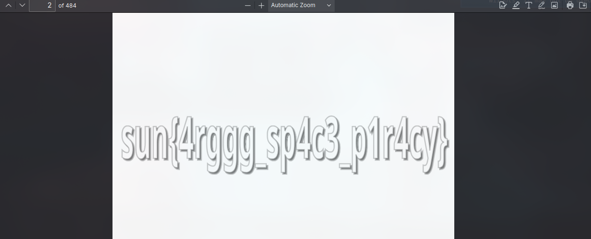

# Intergalactic Copyright Infringement
---

The following answer deemed helpful: [https://superuser.com/a/178846](https://superuser.com/a/178846)

1. Extract data section:
```bash
tshark -r evidence.pcapng -Y 'bittorrent.piece.data and ip.dst_host == 192.168.1.23' -T fields -e bittorrent.piece.index -e bittorrent.piece.begin -e bittorrent.piece.length -e bittorrent.piece.data -E separator=+ > pieces.txt
```
2. Sort the pieces of data:
```bash
sort -n -k1 pieces.txt > sorted_pieces.txt
```
3. Reconstruct it: 
```bash
sed -re 's!.*\+!!' sorted_pieces.txt | sed -re 's!:!!g' | tr -d '[:space:]' | sed 's/../\\x&/g' | echo -n -e $(cat) > reconstructed_file.bin
```
(yeah i used AI for this part i'm not that shell wizard)

4. Ends up being a pdf file, second page contains the flag



---
# Flag
`sun{4rggg_sp4c3_p1r4cy}`
