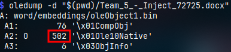
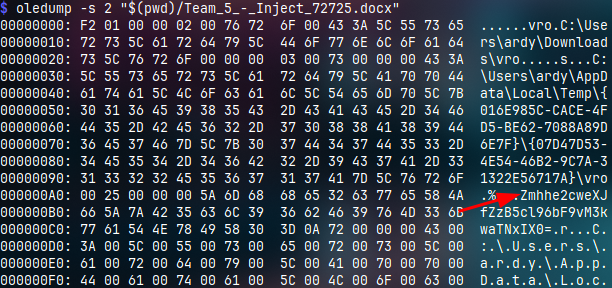

# t0le t0le
---
## Description

> Our CCDC business guy made a really weird inject. He's just obsessed with that damn cat... there's nothing hiding in there, right?

the given file is a docx, based on the description and how t0le rhymes with OLE we can assume we'll deal with OLE objects

1. dump ole objects: `oledump -d "$(pwd)/Team_5_-_Inject_72725.docx"`

2. the second stream has a rather large byte count, we'll select it with: `oledump -s 2 "$(pwd)/Team_5_-_Inject_72725.docx"`

3. we find what looks like a base64 blob, decoding it results in the following string `fha{g0yr_g0yr_zl_o3y0i3q!}`
4. the string looks like a rot13, decoding it gives us the flag

---
# Flag
`sun{t0le_t0le_my_b3l0v3d!}`
