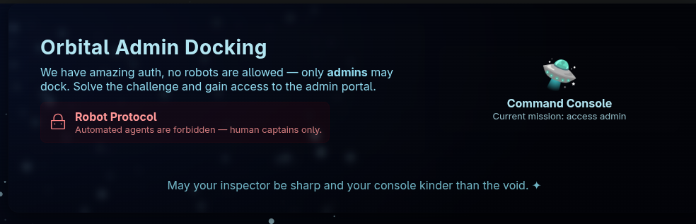
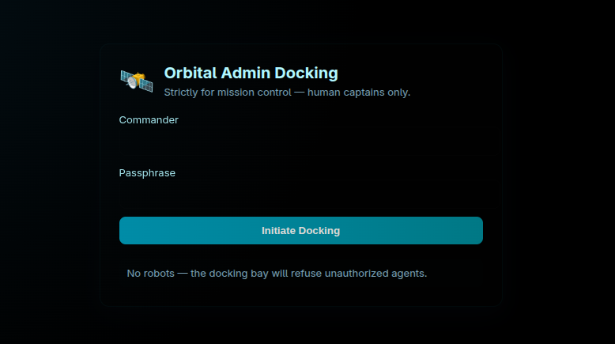
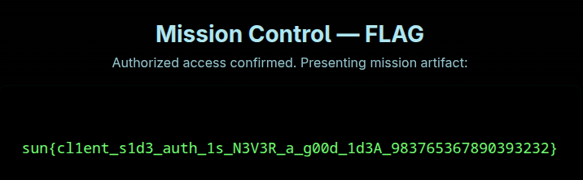

# Lunar Auth
---



Inspecting the page source reveals nothing of interest, browsing to `/robots.txt` shows a single entry of `Disallow: /admin`
## /admin

This time the page source has the following javascript code:
```js
/*
    To reduce load on our servers from the recent space DDOS-ers we have lowered login attempts by using Base64 encoded encryption
    ("encryption" 💀) on the client side.
    
    TODO: implement proper encryption.
    */
const real_username = atob("YWxpbXVoYW1tYWRzZWN1cmVk");
const real_passwd = atob("UzNjdXI0X1BAJCR3MFJEIQ==");

document.addEventListener("DOMContentLoaded", () => {
    const form = document.querySelector("form");

    function handleSubmit(evt) {
        evt.preventDefault();

        const username = form.elements["username"].value;
        const password = form.elements["password"].value;

        if (username === real_username && password === real_passwd) {
            // remove this handler and allow form submission
            form.removeEventListener("submit", handleSubmit);
            form.submit();
        } else {
            alert("[ Invalid credentials ]");
        }
    }

    form.addEventListener("submit", handleSubmit);
});
```
Decoding the base64 blobs of `real_username` and `real_passwd` gets us the credentials: `alimuhammadsecured:S3cur4_P@$$w0RD!`



---
# Flag
`sun{cl1ent_s1d3_auth_1s_N3V3R_a_g00d_1d3A_983765367890393232}`
