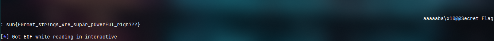

# Jupiter
---
This challenge has a format string vulnerability, based on the assembly code we have to write `0x1337c0de` at the memory address of `0x00404010`

---
# Flag
`sun{F0rmat_str!ngs_4re_sup3r_pOwerFul_r1gh7??}`